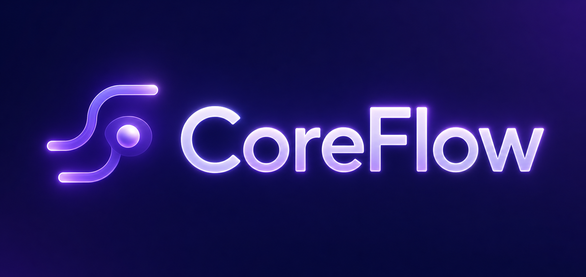
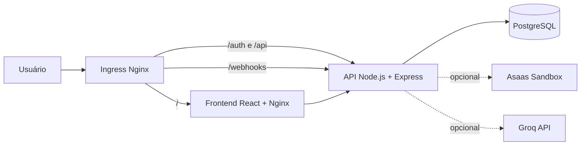

<div align="center">
  

  <h3>⚡ Business OS multi-tenant para operações, clientes e cobranças</h3>

  <p>
    Uma plataforma SaaS responsiva que adapta a experiência do sistema ao nicho de cada empresa,
    mantendo isolamento de dados, licenciamento por tenant e controle de acesso por cargos.
  </p>

  <p>
    
    
    
  </p>

  <p>
    
    
    
    
    
    
  </p>

  <p>
    
    
    
    
    
    
    
    
    
  </p>
</div>

---


<a id="sobre"></a>
## 📌 Sobre o projeto

O **CoreFlow** é um sistema SaaS de gestão empresarial desenvolvido para atender diferentes tipos de negócio sem perder uma experiência simples e consistente.

Cada empresa cadastrada cria um **tenant** isolado. No cadastro, o administrador escolhe o segmento da operação e recebe uma licença exclusiva. O nicho e seus módulos ficam vinculados à licença, enquanto as configurações administrativas continuam personalizáveis.

O sistema já possui uma base full-stack funcional em Kubernetes com:

- frontend React servido por Nginx;
- API Node.js com Express;
- PostgreSQL com Sequelize;
- autenticação JWT e senhas protegidas com bcrypt;
- isolamento multi-tenant;
- RBAC com níveis de acesso;
- financeiro com PIX demonstrativo e suporte opcional ao Asaas Sandbox;
- webhooks de pagamento;
- dashboard operacional e financeiro;
- auditoria das ações importantes;
- tema claro e escuro;
- layout responsivo para desktop e mobile.

## 🧭 Navegação rápida

| Seção | Conteúdo |
| --- | --- |
| [✨ Funcionalidades](#funcionalidades) | Recursos concluídos no sistema |
| [🏗️ Arquitetura](#arquitetura) | Componentes e estrutura do projeto |
| [🧰 Stack](#stack) | Tecnologias utilizadas |
| [🚀 Execução](#execucao) | Deploy local validado com Minikube |
| [🧪 Testes](#testes) | Jest, lint, build e Hoppscotch |
| [🗺️ Roadmap](#roadmap) | Próximas evoluções planejadas |

## 🌟 Destaques

| | Recurso | Resultado |
| --- | --- | --- |
| 🏢 | **Multi-tenancy** | Dados isolados por empresa usando `tenant_id` |
| 🔑 | **Licença inteligente** | Nicho e módulos vinculados no momento do cadastro |
| 🧩 | **10 nichos** | Recursos e campos personalizados para cada operação |
| 💳 | **Financeiro** | PIX demo, recorrências, cancelamentos e webhooks |
| 🛡️ | **RBAC** | Permissões separadas para administrador, gerente e funcionário |
| 📊 | **Insights** | Métricas reais e resumo opcional enriquecido com IA |
| 🧾 | **Auditoria** | Histórico de ações administrativas importantes |
| 📱 | **Responsividade** | Navegação preparada para desktop e mobile |

<a id="funcionalidades"></a>
## ✨ Funcionalidades disponíveis

### 🔐 Autenticação, segurança e licenciamento

- Cadastro transacional de tenant e administrador com Sequelize.
- Login protegido por JWT.
- Senhas armazenadas com hash bcrypt.
- `JWT_SECRET` fornecido por variável de ambiente ou Secret Kubernetes.
- Ativação restrita ao tenant do usuário autenticado.
- Licença exclusiva no formato `ABCD-1234-EFGH-5678`.
- Nicho e módulos salvos na licença durante o cadastro.
- Bloqueio de alteração posterior do perfil licenciado.
- Compatibilidade transparente com tenants criados antes do novo modelo de licença.
- Middleware que bloqueia módulos internos enquanto a licença não estiver ativa.

### 🏢 SaaS multi-tenant

- Todos os dados operacionais são vinculados ao `tenant_id`.
- Consultas e alterações validam o tenant autenticado.
- Clientes, cobranças, usuários, auditoria e insights são separados por empresa.
- Um tenant não pode ativar, visualizar ou modificar recursos pertencentes a outro tenant.

### 🧩 Perfis por nicho

O CoreFlow adapta nomes, campos adicionais, sugestões de cobrança, módulos e prioridades operacionais conforme o segmento escolhido no cadastro.

| Nicho | Exemplos de módulos licenciados |
| --- | --- |
| Varejo e comércio | Relacionamento, cobranças, vendas, catálogo e estoque, fidelização |
| Academia e fitness | Alunos, mensalidades, frequência, planos, avaliações |
| Clínica e consultório | Pacientes, recebimentos, agenda, serviços, retornos |
| Barbearia e salão | Clientes, recebimentos, agenda, profissionais, pacotes |
| Igreja e comunidade | Membros, contribuições, atividades, grupos, eventos |
| Prestação de serviços | Clientes, cobranças, serviços, propostas, contratos |
| Restaurante e alimentação | Clientes, recebimentos, pedidos, reservas, fidelização |
| Escola e cursos | Alunos, mensalidades, turmas, matrículas, frequência |
| Pet shop e veterinária | Tutores e pets, recebimentos, agenda, pets, pacotes |
| Oficina e auto center | Clientes e veículos, cobranças, ordens de serviço, veículos, manutenções |

Cada módulo possui opções internas específicas. Uma academia, por exemplo, recebe recursos relacionados a frequência, alertas de ausência, objetivos e renovações. Uma oficina recebe ordens de serviço, acompanhamento de peças, revisões e histórico de veículos.

### 👥 Gestão de clientes

- Cadastro, edição, busca e exclusão controlada por cargo.
- Dados básicos: nome, documento, e-mail e telefone.
- Metadados dinâmicos conforme o nicho.
- Exibição de informações específicas na listagem.
- Preparação do cliente para vínculo com o gateway de pagamento.

### 💳 Financeiro

- Geração de cobranças avulsas.
- Cobranças recorrentes com ciclos semanal, quinzenal, mensal, trimestral, semestral e anual.
- Meio de cobrança configurável: PIX, boleto e cartão.
- Sugestões de cobrança adequadas ao nicho.
- Filtros por status e busca textual.
- Cancelamento de cobranças pendentes.
- Pausa e reativação de recorrências.
- Cópia do código PIX.
- Link de pagamento quando fornecido pelo gateway.

Por padrão, o ambiente usa:

```text
PAYMENT_PROVIDER=demo
```

Nesse modo, o sistema gera um código `CORE_FLOW_DEMO_PIX` sem valor bancário e permite simular o pagamento pela interface. Isso torna possível demonstrar o fluxo completo sem criar uma conta externa.

O backend também está preparado para o **Asaas Sandbox**. A ativação é opcional e feita somente por variáveis seguras no servidor.

### 🔔 Webhooks de pagamento

- Endpoint público `POST /webhooks/asaas`.
- Validação do token recebido no header `asaas-access-token`.
- Proteção contra processamento duplicado de eventos.
- Atualização automática da fatura para `PAID`, `OVERDUE` ou `CANCELED`.
- Criação de cobranças originadas por assinaturas.
- Registro da mudança no log de auditoria.

### 🛡️ RBAC: controle por cargos

| Recurso | Administrador | Gerente | Funcionário |
| --- | :---: | :---: | :---: |
| Visualizar dashboard e insights | ✅ | ✅ | — |
| Visualizar operação licenciada | ✅ | ✅ | ✅ |
| Cadastrar clientes | ✅ | ✅ | ✅ |
| Editar clientes | ✅ | ✅ | — |
| Excluir clientes | ✅ | — | — |
| Visualizar financeiro | ✅ | ✅ | — |
| Gerar e cancelar cobranças | ✅ | — | — |
| Gerenciar usuários e cargos | ✅ | — | — |
| Visualizar auditoria | ✅ | — | — |
| Alterar configurações administrativas | ✅ | — | — |

### 📊 Dashboard e insights

- Indicadores de clientes, cobranças pendentes, cobranças pagas e receita confirmada.
- Receita mensal dos últimos seis meses.
- Últimas cobranças registradas.
- Prioridades operacionais conforme o nicho.
- Resumo em linguagem natural calculado a partir dos dados do tenant.
- Integração opcional com a API da Groq para enriquecer o texto analítico.
- Fallback local quando a integração externa não estiver configurada ou disponível.

### 🧾 Auditoria

- Registro das ações administrativas relevantes.
- Identificação do usuário, tenant, entidade e ação executada.
- Histórico consultável somente por administradores.
- Busca e filtros pela interface.
- Rastreamento de cobranças, recorrências, usuários, clientes, configurações e webhooks.

### 🎨 Experiência de uso

- Interface responsiva para desktop e mobile.
- Navegação adaptada ao cargo do usuário.
- Tema claro e escuro.
- Tela de cadastro com escolha única do segmento.
- Tela de operação com módulos licenciados e opções específicas do nicho.
- Configurações administrativas para empresa, fuso horário, moeda, formato de data, alertas e padrões financeiros.
- Fallback SPA no Nginx para suportar React Router após atualizar a página.

<a id="arquitetura"></a>
## 🏗️ Arquitetura



### 📁 Estrutura principal

```text
Core-Flow-main/
├── .k8s/                  # Deployments, Services, Ingress, ConfigMap e PostgreSQL
├── backend/
│   ├── controllers/      # Casos de uso da API
│   ├── middlewares/      # Autenticação, tenant ativo e RBAC
│   ├── models/           # Modelos Sequelize
│   ├── routes/           # Rotas HTTP
│   ├── services/         # Pagamentos, auditoria, perfis e preferências
│   └── tests/            # Testes Jest
├── docs/
│   ├── tests/            # Coleção Hoppscotch e materiais de QA
│   └── CONFIGURATION.md  # Integrações opcionais
└── frontend/
    ├── public/images/    # Ativos visuais CoreFlow
    └── src/              # Interface React
```

<a id="stack"></a>
## 🧰 Stack tecnológica

| Camada | Tecnologias |
| --- | --- |
| Frontend | React 19, Vite, React Router, Axios, TailwindCSS, Lucide React |
| Backend | Node.js 20, Express, Sequelize, JWT, bcrypt |
| Banco de dados | PostgreSQL 16 |
| Containers | Docker com builds multi-stage |
| Orquestração | Kubernetes, Minikube, Nginx Ingress Controller |
| Testes | Jest e coleção Hoppscotch |
| Integrações opcionais | Asaas Sandbox e Groq API |

<a id="execucao"></a>
## 🚀 Executando com Minikube

Este é o fluxo principal, validado no ambiente atual do projeto.

### ✅ Pré-requisitos

- [Docker Desktop](https://www.docker.com/products/docker-desktop/)
- [Minikube](https://minikube.sigs.k8s.io/docs/start/)
- `kubectl`
- Node.js 20+ para desenvolvimento e testes locais

### 1️⃣ Inicie o cluster

```powershell
minikube start
minikube addons enable ingress
```

### 2️⃣ Configure os secrets

Crie `.k8s/secret.yaml` usando [docs/kubernetes-secret.example.yaml](docs/kubernetes-secret.example.yaml) como referência:

```powershell
Copy-Item docs\kubernetes-secret.example.yaml .k8s\secret.yaml
```

Substitua os valores de exemplo antes de aplicar. O arquivo real `.k8s/secret.yaml` é ignorado pelo Git.

### 3️⃣ Gere as imagens Docker

```powershell
cd D:\Projetos\Core-Flow-main\backend
docker build -t rennanmk9/coreflow-api:1.0.10 .

cd D:\Projetos\Core-Flow-main\frontend
docker build -t rennanmk9/coreflow-front:1.0.17 .
```

### 4️⃣ Carregue as imagens locais no Minikube

Isso permite testar antes de enviar imagens ao registry:

```powershell
minikube image load rennanmk9/coreflow-api:1.0.10
minikube image load rennanmk9/coreflow-front:1.0.17
```

### 5️⃣ Aplique os manifests

```powershell
cd D:\Projetos\Core-Flow-main
kubectl apply -f .k8s\configmap.yaml
kubectl apply -f .k8s\secret.yaml
kubectl apply -f .k8s\postgres.yaml
kubectl apply -f .k8s\backend_service.yml
kubectl apply -f .k8s\backend_deployment.yml
kubectl apply -f .k8s\frontend_service.yml
kubectl apply -f .k8s\frontend_deployment.yml
kubectl apply -f .k8s\ingress.yaml
```

### 6️⃣ Verifique o rollout

```powershell
kubectl rollout status deployment/coreflow-api-deployment
kubectl rollout status deployment/coreflow-front-deployment
kubectl get pods
kubectl logs deployment/coreflow-api-deployment --tail=100
```

### 7️⃣ Abra a aplicação

Para um teste simples com URL temporária:

```powershell
minikube service coreflow-front-service --url
```

Para utilizar o Ingress, descubra o IP:

```powershell
minikube ip
```

Adicione ao arquivo `C:\Windows\System32\drivers\etc\hosts`:

```text
<SEU_MINIKUBE_IP> coreflow.seudominio.com
```

Depois acesse:

```text
http://coreflow.seudominio.com
```

<a id="testes"></a>
## 🧪 Testes e qualidade

### ⚙️ Backend

```powershell
cd D:\Projetos\Core-Flow-main\backend
npm install
npm test -- --runInBand
```

Cobertura:

```powershell
npm run test:coverage
```

A suíte atual cobre:

- pagamentos demonstrativos;
- webhooks;
- RBAC;
- catálogo de perfis por nicho;
- persistência dos módulos licenciados;
- normalização das preferências administrativas;
- compatibilidade com tenants legados.

### 🖥️ Frontend

```powershell
cd D:\Projetos\Core-Flow-main\frontend
npm install
npm run lint
npm run build
```

### 📡 Testes de API com Hoppscotch

A coleção exportada está disponível em:

```text
docs/tests/coreflow-hoppscotch-collection.json
```

Ela pode ser importada no [Hoppscotch](https://hoppscotch.io/) para validar os fluxos HTTP do projeto.

## 🔌 Configurações e integrações

As integrações opcionais estão documentadas em [docs/CONFIGURATION.md](docs/CONFIGURATION.md).

| Variável | Obrigatória | Uso |
| --- | :---: | --- |
| `JWT_SECRET` | ✅ | Assinatura dos tokens JWT |
| `DB_USER`, `DB_PASSWORD`, `DB_NAME` | ✅ | Acesso ao PostgreSQL |
| `PAYMENT_PROVIDER` | ✅ | `demo` por padrão ou `asaas` para Sandbox |
| `ASAAS_BASE_URL` | somente Asaas | Endpoint do ambiente Sandbox |
| `ASAAS_API_KEY` | somente Asaas | Chave privada do gateway |
| `ASAAS_WEBHOOK_TOKEN` | somente Asaas | Validação dos webhooks recebidos |
| `GROQ_API_KEY` | opcional | Insights em linguagem natural usando IA |
| `GROQ_MODEL` | opcional | Modelo usado na integração Groq |

> Nunca envie `.env` ou `.k8s/secret.yaml` ao repositório. Use apenas o arquivo sanitizado de exemplo.

## 🛣️ Rotas principais da API

| Método | Rota | Descrição |
| --- | --- | --- |
| `POST` | `/auth/register` | Cria tenant, administrador e licença |
| `POST` | `/auth/login` | Autentica o usuário |
| `POST` | `/auth/activate` | Ativa somente o tenant autenticado |
| `GET` | `/api/business-profiles` | Lista os nichos disponíveis |
| `GET`, `PUT` | `/api/tenant` | Consulta e atualiza preferências administrativas |
| `GET`, `POST`, `PUT`, `DELETE` | `/api/persons` | Gerencia clientes do tenant |
| `GET`, `POST` | `/api/finance/invoices` | Lista e gera cobranças |
| `POST` | `/api/finance/invoices/subscriptions` | Cria recorrências |
| `GET`, `POST`, `PUT`, `DELETE` | `/api/users` | Gerencia usuários e cargos |
| `GET` | `/api/audit-logs` | Consulta auditoria |
| `GET` | `/api/insights` | Retorna métricas e resumo operacional |
| `POST` | `/webhooks/asaas` | Recebe notificações do gateway |

<a id="roadmap"></a>
## 🗺️ Roadmap

As funcionalidades abaixo fazem parte da evolução planejada e ainda não devem ser consideradas concluídas.

### 🟣 Curto prazo

- [ ] Criar páginas operacionais completas para cada módulo licenciado, além do resumo atual.
- [ ] Implementar agenda com calendário, confirmações e lista de espera.
- [ ] Implementar pedidos, propostas, contratos e ordens de serviço com seus próprios fluxos.
- [ ] Adicionar paginação, ordenação e exportação CSV nas listagens.
- [ ] Adicionar recuperação de senha e troca segura de senha.
- [ ] Criar notificações visuais dentro da aplicação.
- [ ] Atualizar o `docker-compose.yml` para refletir o build de produção servido pelo Nginx.

### 🔵 Médio prazo

- [ ] Criar integração completa com Asaas em ambiente Sandbox e homologar webhooks reais.
- [ ] Adicionar Mercado Pago como segundo gateway.
- [ ] Gerar QR Code visual para PIX.
- [ ] Criar planos comerciais do CoreFlow e cobrança da assinatura do próprio tenant.
- [ ] Adicionar upload de documentos e anexos.
- [ ] Criar relatórios exportáveis em PDF e planilhas.
- [ ] Adicionar templates de e-mail e mensagens para cobranças e lembretes.
- [ ] Implementar migrations Sequelize versionadas para produção.

### 🟢 Longo prazo

- [ ] Painéis analíticos específicos por nicho.
- [ ] Assistente de IA conversacional com histórico e sugestões acionáveis.
- [ ] Aplicativo mobile ou experiência PWA instalável.
- [ ] Observabilidade com métricas, tracing e alertas.
- [ ] CI/CD automatizado para testes, build e deploy.
- [ ] Deploy em ambiente cloud com domínio real, TLS e backups automatizados.
- [ ] Testes end-to-end para jornadas críticas.

## 📝 Observações de desenvolvimento

- O `docker-compose.yml` atual é um artefato legado de desenvolvimento e ainda precisa ser alinhado ao frontend Nginx utilizado no fluxo Kubernetes.
- O modo PIX demonstrativo é intencional e não movimenta valores reais.
- As chaves externas devem existir somente no backend e em Secrets do ambiente.
- O nicho é escolhido no cadastro e protegido pela licença; Configurações não altera o segmento da empresa.

## 👨‍💻 Autor

Desenvolvido por **Rennan de Oliveira Cardoso**<br />
Estudante de Engenharia de Software | Full-Stack Developer
